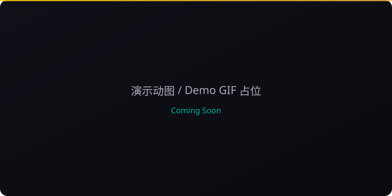

<!-- profile-readme: generated with care -->
<!-- Do not edit AUTO-UPDATE blocks manually; they are refreshed daily by GitHub Actions -->

  <!-- Animated hero banner -->
  

    

  <!-- Greeting -->
  <!-- AUTO-UPDATE: greeting -->
  <h3> 🌙 Good evening — thanks for contributing a line today</h3>

  <!-- Visitor count -->
  <!-- AUTO-UPDATE: visitor-count -->
  

    

  <!-- Tagline -->
  

    <i>"Code like ink wash, architect like negative space."</i>
  

<!-- AUTO-UPDATE: weather -->
<!-- Weather placeholder written by Actions -->

---

## 🧑‍💻 About Me

> Three lines, distilled:

- 🔴 **Full-Stack Developer**: from pixels to databases, I polish every product detail with an end-to-end mindset.
- 🟢 **Open-Source Enthusiast**: I believe a single good line of code can light up another developer's night, so I keep giving back.
- 🟡 **Lifelong Learner**: technology evolves, taste settles, and I keep exploring new tools and design sensibilities.

<!-- AUTO-UPDATE: profile-views-line -->

---

## 🛡️ Skills

### Frontend

### Backend

### DevOps & Tooling

---

## ⚡ Tech Stack

  

---

## 🏆 Featured Projects

<!-- AUTO-UPDATE: project-stats-start -->

| Project | Value Proposition | Tech Stack | Stars / Forks | Preview |
|---------|-------------------|------------|---------------|---------|

| <b><a href="https://github.com/ajithberlin/ajithberlin.github.io">ajithberlin.github.io</a></b> | An open-source project in continuous iteration |  | ⭐ 0 · 🍴 0 |  |
| <b><a href="https://github.com/ajithberlin/bixel-native">bixel-native</a></b> | A native iOS pixel-art playground that brings retro creation to mobile. |  | ⭐ 1 · 🍴 0 |  |
| <b><a href="https://github.com/ajithberlin/Reactive-Resume">Reactive-Resume</a></b> | A one-of-a-kind resume builder that keeps your privacy in mind. Completely secure, customizable, portable, open-source and free forever. Try it out today! |  | ⭐ 0 · 🍴 0 |  |
<!-- AUTO-UPDATE: project-stats-end -->

---

## 📊 GitHub Stats

  
  

 

  

---

## 📝 Latest Updates

<!-- AUTO-UPDATE: latest-activity-start -->

- 🚀 2026-09-13 — Merge pull request #1 from ajithberlin/copilot/add-g...
<!-- AUTO-UPDATE: latest-activity-end -->

---

## One Line for Open Source

> <i>"Every line of open-source code is a letter to the future."</i>

 

<!-- Contact -->

  

<!-- Footer -->

  Auto-deployed daily by <a href=".github/workflows/profile.yml">GitHub Actions</a> · Dark mode first · Responsive design

